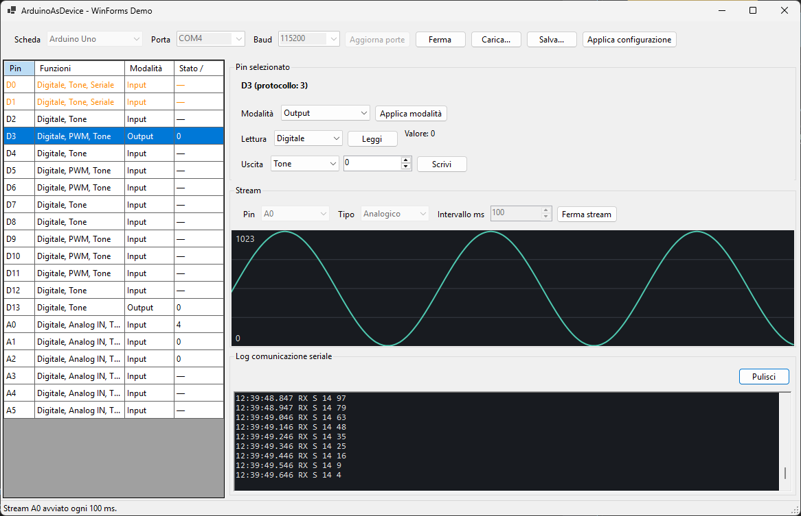

# ArduinoAsDevice

Controlla una scheda Arduino da un'applicazione .NET via porta seriale: configura i pin come input/output, leggi e scrivi valori digitali e analogici, genera onde a frequenza e ampiezza regolabili e ricevi letture in continuo (streaming) direttamente dal firmware.

Il progetto è composto da due parti:

1. **Firmware Arduino** — sketch generico compatibile con le schede AVR più comuni (Uno, Nano, Mega, Leonardo…)
2. **Libreria .NET** — disponibile sia per **.NET moderno (net8.0)** sia per **.NET Framework 4.8**, con gli stessi sorgenti condivisi

## Struttura del repository

```
ArduinoAsDevice/
├── firmware/
│   └── ArduinoAsDevice/
│       └── ArduinoAsDevice.ino        # sketch firmware (parser comandi + streaming)
├── src/
│   ├── Shared/                        # sorgenti C# condivisi tra i due target
│   ├── ArduinoAsDevice.Net/           # libreria .NET 8.0
│   └── ArduinoAsDevice.NetFx/         # libreria .NET Framework 4.8
├── samples/
│   ├── ConsoleDemo/                   # applicazione console di esempio
│   └── WinFormsDemo/                  # pannello desktop Windows per pin e stream
└── ArduinoAsDevice.sln
```

## Installazione del firmware

1. Apri `firmware/ArduinoAsDevice/ArduinoAsDevice.ino` con l'IDE Arduino
2. Seleziona la scheda e la porta corretta
3. Carica lo sketch

Il firmware apre la seriale a **115200 baud** e risponde a comandi testuali (uno per riga).

## Uso della libreria

### Riferimenti

- **.NET 8+**: referenzia `src/ArduinoAsDevice.Net/ArduinoAsDevice.Net.csproj` (richiede il pacchetto NuGet `System.IO.Ports`, già incluso)
- **.NET Framework 4.8**: referenzia `src/ArduinoAsDevice.NetFx/ArduinoAsDevice.NetFx.csproj`

### Esempio

```csharp
using ArduinoAsDevice;

using var dev = new ArduinoDevice("COM3");   // oppure /dev/ttyUSB0 su Linux/macOS
dev.Open();

// Configura un pin come output e scrivilo
dev.SetPinMode(13, PinMode.Output);
dev.DigitalWrite(13, true);

// Lettura digitale e analogica
bool stato = dev.DigitalRead(2);
int valore = dev.AnalogRead(14);             // A0 = pin 14 sulle schede AVR

// Ampiezza PWM (duty cycle 0-255)
dev.AnalogWrite(9, 128);

// Onda quadra a frequenza regolabile (0 = stop)
dev.SetTone(8, 440);                          // 440 Hz

// Streaming: lettura automatica ogni 250 ms
dev.ReadingReceived += (s, e) =>
    Console.WriteLine($"pin {e.Pin} = {e.Value}");
dev.StartStream(pin: 14, analog: true, intervalMs: 250);
// ...
dev.StopStream();
```

### API principale (`ArduinoDevice`)

| Metodo | Descrizione |
|---|---|
| `Open()` / `Dispose()` | Apre/chiude la connessione seriale |
| `Ping()` | Verifica la connessione, restituisce la versione del firmware |
| `SetPinMode(pin, PinMode)` | Configura il pin: `Input`, `Output`, `InputPullup` |
| `DigitalWrite(pin, bool)` | Scrive HIGH/LOW |
| `DigitalRead(pin)` | Legge lo stato digitale |
| `AnalogWrite(pin, 0-255)` | Imposta il duty cycle PWM (ampiezza) |
| `AnalogRead(pin)` | Legge il valore analogico (0-1023) |
| `SetTone(pin, freqHz)` | Genera un'onda quadra alla frequenza indicata (`0` = stop) |
| `StartStream(pin, analog, intervalMs)` | Avvia l'invio automatico delle letture |
| `StopStream()` | Ferma lo streaming |
| `event ReadingReceived` | Scatenato a ogni lettura ricevuta dallo streaming |
| `Logger` | Callback `Action<string, bool>` per loggare la comunicazione (riga, direzione: `true` = inviata) |
| `LogOutput` | `TextWriter` su cui scrivere il log seriale con timestamp (es. `Console.Out` o un file) |

### Logging della comunicazione seriale

```csharp
// Opzione 1: su console/file con timestamp automatico
dev.LogOutput = Console.Out;
// oppure su file:
dev.LogOutput = new StreamWriter("serial.log") { AutoFlush = true };

// Opzione 2: callback personalizzata
dev.Logger = (line, sent) =>
    Console.WriteLine(sent ? $"TX: {line}" : $"RX: {line}");
```

Esempio di output su `LogOutput`:

```
22:31:04.512 >> PING
22:31:04.530 << PONG 1.0.0
22:31:04.612 >> DREAD 2
22:31:04.625 << D 2 1
```

## Protocollo seriale

Un comando per riga (`\n`), risposte su una riga:

| Comando | Risposta |
|---|---|
| `PING` | `PONG <versione>` |
| `MODE <pin> <IN\|OUT\|IN_PULLUP>` | `OK` / `ERR <msg>` |
| `DWRITE <pin> <0\|1>` | `OK` / `ERR <msg>` |
| `DREAD <pin>` | `D <pin> <0\|1>` |
| `AWRITE <pin> <0-255>` | `OK` / `ERR <msg>` |
| `AREAD <pin>` | `A <pin> <0-1023>` |
| `TONE <pin> <freqHz>` | `OK` (0 = stop) |
| `STREAM <A\|D> <pin> <interval_ms>` | `OK`, poi `S <pin> <value>` ogni intervallo |
| `STREAM STOP` | `OK` |

Lo streaming supporta **un pin alla volta**. Le righe `S ...` sono asincrone; le altre righe sono risposte sincrone ai comandi.

## Build

```bash
dotnet build ArduinoAsDevice.sln
```

Compila entrambe le librerie (net8.0 e net48) e il sample console.

### Eseguire il sample

```bash
dotnet run --project samples/ConsoleDemo -- COM3
```

Senza argomenti mostra le porte seriali disponibili.

### Demo WinForms

Su Windows è disponibile anche un pannello grafico per:

- scegliere il profilo Arduino Uno, Nano o Mega e la porta COM;
- aprire e chiudere la comunicazione;
- configurare modalità, stato digitale, PWM e tone dei pin compatibili;
- leggere e rappresentare lo stato dei pin;
- visualizzare lo stream analogico o digitale di un pin in un grafico;
- consultare il log seriale con timestamp e direzione TX/RX;
- salvare e caricare porta, baud rate, pin e parametri stream in JSON.

```bash
dotnet run --project samples/WinFormsDemo
```



I pin D0/D1 sono mostrati ma protetti perché usati dalla seriale. Il caricamento
di un file aggiorna la UI senza connettere il dispositivo né avviare lo stream:
se il dispositivo è già connesso, usare **Applica configurazione** per inviare le
impostazioni. Come il protocollo, il grafico gestisce un solo pin alla volta.

## Note e limiti

- Sulle schede AVR i pin analogici A0-A5 corrispondono ai numeri 14-19
- `tone()` usa un timer hardware: su alcune schede può interferire con il PWM dei pin 3 e 11
- Lo streaming è limitato a un pin alla volta (per semplicità del protocollo)
- All'apertura della porta seriale le schede AVR si resettano: la libreria attende ~2 s prima di comunicare
